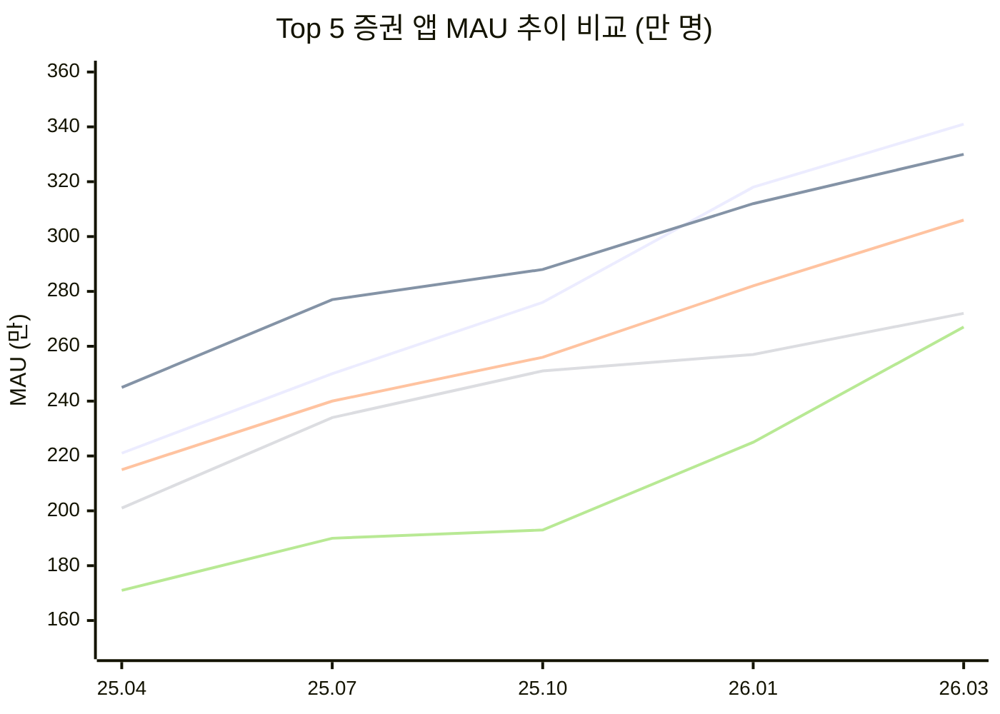
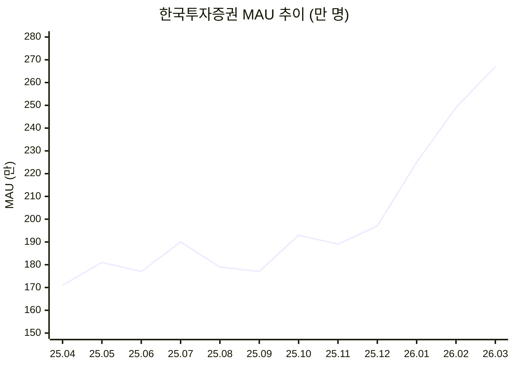
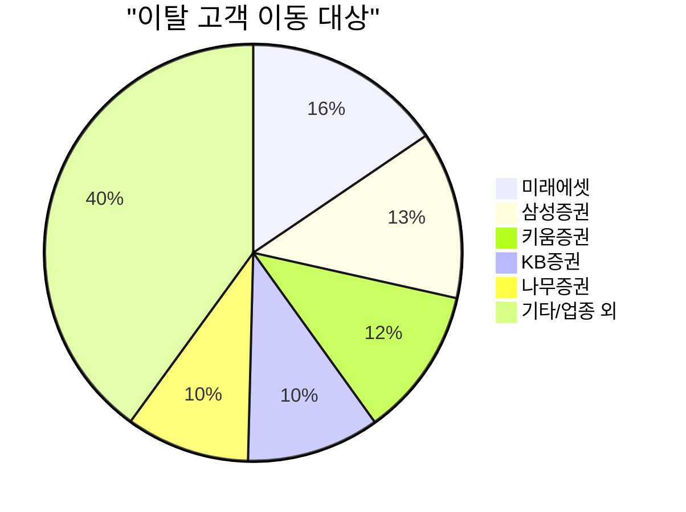

# 한국투자증권 앱 전략 보고서

> 작성일: 2026년 4월 | 데이터 기준: 2026년 3월 | 출처: 모바일인덱스

---

## Executive Summary

한국투자증권 앱은 지난 12개월간 증권 앱 시장에서 가장 빠른 성장세(+56.6%)를 기록하며, 5위에서 4위권 진입을 눈앞에 두고 있다. 20~30대 여성 투자자 유입이라는 차별화된 강점을 보유하고 있으나, 사용 시간 대비 사용자 수 성장에 편중된 구조, 그리고 이탈 고객의 50%가 경쟁사로 이동하는 문제를 해결해야 한다. 본 보고서는 데이터 기반으로 현재 위치를 진단하고, 1위 도약을 위한 전략 방향을 제시한다.

---

## 1. 시장 환경 분석

### 1-1. 증권/투자 앱 시장 규모

| 지표 | 2025.04 | 2026.03 | 변화 |
|------|---------|---------|------|
| 업종 MAU | 1,251만 | 1,607만 | +28.5% |
| 월 신규 설치 | 88만 | 185만 | +109.7% |

시장 자체가 빠르게 성장하고 있다. 12개월간 MAU 28.5% 증가, 신규 설치는 2배 이상 늘었다. 투자 인구 저변이 확대되고 있으며, 이는 후발 주자에게 유리한 환경이다.

### 1-2. 경쟁 구도 (2026년 3월)

| 순위 | 앱 | MAU | 점유율 | 12개월 성장률 |
|------|-----|-----|--------|-------------|
| 1 | 미래에셋 M-STOCK | 341만 | 21.2% | +54.2% |
| 2 | 키움 영웅문S# | 330만 | 20.5% | +34.7% |
| 3 | 삼성증권 mPOP | 306만 | 19.0% | +42.1% |
| 4 | KB증권 M-able | 272만 | 16.9% | +35.2% |
| **5** | **한국투자증권** | **267만** | **16.6%** | **+56.6%** |
| 6 | 나무증권(NH) | 233만 | 14.5% | - |
| 7 | 신한 SOL증권 | 176만 | 11.0% | - |

핵심 관찰:
- 미래에셋이 2025년 하반기에 키움을 역전하고 1위를 차지했다
- 한국투자증권은 성장률 1위(+56.6%)이나, 절대 MAU에서 4위 KB와 5만 차이
- Top 5가 시장의 94%를 점유하는 과점 구조
- 한투의 성장 기울기가 가장 가파르며, KB와의 교차가 임박해 있다

---

## 2. 한국투자증권 앱 현황 진단

### 2-1. 사용자 성장 추이

| 월 | MAU | 전월비 | 신규 설치 |
|----|-----|--------|----------|
| 25.04 | 171만 | - | 5.5만 |
| 25.07 | 190만 | +11.7% | 7.7만 |
| 25.10 | 193만 | +1.6% | 11.8만 |
| 26.01 | 225만 | +16.3% | 19.5만 |
| 26.02 | 249만 | +10.8% | 21.9만 |
| 26.03 | 267만 | +7.1% | 19.4만 |

2025년 10월 이후 급격한 성장 곡선을 그리고 있다. 특히 2026년 1~2월에 신규 설치가 월 19~22만 건으로 폭증했다.

### 2-2. 사용 시간 분석 (인게이지먼트)

| 월 | 총 사용 시간(시간) | 1인당 평균(분) |
|----|-------------------|---------------|
| 25.04 | 461만 | 약 162분 |
| 25.07 | 628만 | 약 198분 |
| 25.10 | 690만 | 약 214분 |
| 26.01 | 980만 | 약 261분 |
| 26.03 | 1,103만 | 약 248분 |

총 사용 시간은 12개월간 139% 증가했다. 1인당 평균 사용 시간도 162분 → 248분으로 53% 늘었다. 사용자가 늘어나는 것뿐 아니라, 기존 사용자의 인게이지먼트도 깊어지고 있다.

### 2-3. 사용자 데모그래픽

| 구분 | 한투 | 미래에셋 | 키움 | 삼성 | KB |
|------|------|---------|------|------|-----|
| 여성 비율 | **57.7%** | 54.7% | 49.7% | 52.8% | 53.7% |
| 남성 비율 | 42.3% | 45.3% | 50.3% | 47.2% | 46.4% |

한국투자증권의 여성 비율 57.7%는 Top 5 중 압도적 1위다. 키움(49.7%)과 8%p 차이.

연령대 상세:

| 연령대 | 한투 | 미래에셋 | 키움 | 삼성 | KB |
|--------|------|---------|------|------|-----|
| 여20대 | **12.8%** | 10.8% | 8.0% | 9.3% | 9.0% |
| 여30대 | **15.2%** | 13.0% | 13.6% | 12.2% | 12.5% |
| 여40대 | 18.1% | 18.2% | 18.2% | 17.2% | 18.0% |
| 남20대 | 9.4% | 9.0% | 9.0% | 8.9% | 9.1% |
| 남30대 | 10.5% | 10.1% | 12.9% | 10.2% | 9.8% |
| 남50대 | 8.4% | 10.5% | 6.7% | 12.3% | 11.1% |

핵심 발견:
- 한투는 20대 여성(12.8%)과 30대 여성(15.2%) 비율이 경쟁사 대비 확연히 높다

```mermaid
xychart-beta
  title "2030 여성 비율 비교 (%)"
  x-axis ["한투","미래에셋","키움","삼성","KB"]
  y-axis "비율 (%)" 0 --> 30
  bar "여20대" [12.8,10.8,8.0,9.3,9.0]
  bar "여30대" [15.2,13.0,13.6,12.2,12.5]
```

- 반면 50대 이상 남성 비율은 경쟁사 대비 낮다
- 젊은 여성 투자자가 한투를 선택하는 뚜렷한 패턴이 존재한다

### 2-4. 사용자 페르소나 (Top 10)

| 순위 | 페르소나 | 비율 |
|------|---------|------|
| 1 | 음악 구독 서비스 유저 | 88.3% |
| 2 | OTT 구독 서비스 유저 | 83.5% |
| 3 | 식료품점 쇼퍼 | 65.5% |
| 4 | 보험 가입자 | 60.2% |
| 5 | 증권/투자 앱 상위 40% 사용자 | 55.0% |
| 6 | 직장인 | 50.6% |
| 7 | 가상화폐 앱 이용 유저 | 48.7% |
| 8 | 부동산 투자 관심 유저 | 48.1% |
| 9 | 아웃도어 액티비티 관심 유저 | 44.7% |
| 10 | 제2금융권 이용자 | 38.7% |

주목할 점:
- 가상화폐 이용자 48.7% → 크립토 투자에도 관심이 높은 멀티 투자자층
- 부동산 투자 관심 48.1% → 주식 외 자산 배분에 관심
- 직장인 50.6% → 안정적 소득 기반의 투자자
- 초등학생 학부모 27.6% → 30~40대 자녀 양육 세대

### 2-5. 관심 업종 (Top 5)

| 순위 | 업종 | 관심도 초과 비율 |
|------|------|----------------|
| 1 | 식음료 | +29.0%p |
| 2 | 가정/생활 | +25.1%p |
| 3 | 건강/의료 | +24.9%p |
| 4 | 쇼핑 | +24.1%p |
| 5 | 여행/교통 | +23.7%p |

한투 사용자는 일반 인구 대비 식음료, 가정/생활, 건강/의료에 대한 관심이 특히 높다. 생활 밀착형 소비자이면서 투자자인 프로필이다.

### 2-6. 지역 분포

| 순위 | 지역 | 비율 |
|------|------|------|
| 1 | 서울 | 26.9% |
| 2 | 경기 | 25.4% |
| 3 | 부산 | 8.0% |
| 4 | 광주 | 5.2% |
| 5 | 인천 | 4.9% |

수도권(서울+경기+인천) 비율이 57.2%로, 수도권 집중도가 높다.

---

## 3. 이탈 분석 — 가장 시급한 과제

### 3-1. 이탈 규모

2026년 3월 기준, 한국투자증권 앱 이탈 고객 수: **46.3만 명**

| 구분 | 수치 | 비율 |
|------|------|------|
| 업종 내 이동 (경쟁사로 전환) | 23.2만 | 50.1% |
| 업종 외 이탈 (증권 앱 자체를 안 씀) | 23.1만 | 49.9% |

이탈 고객의 절반이 경쟁사로 갔다. 이건 심각한 신호다.

### 3-2. 이탈 고객이 간 곳

| 순위 | 이동 대상 | 이탈 수 | 비율 |
|------|----------|---------|------|
| 1 | 미래에셋 M-STOCK | 7.2만 | 15.5% |
| 2 | 삼성증권 mPOP | 6.0만 | 13.0% |
| 3 | 키움 영웅문S# | 5.3만 | 11.6% |
| 4 | KB증권 M-able | 4.7만 | 10.3% |
| 5 | 나무증권(NH) | 4.4만 | 9.6% |

미래에셋으로의 이탈이 가장 크다. 1위 앱의 흡인력이 작용하고 있다.

### 3-3. 이탈 분석 인사이트

- 신규 유입(월 19만)은 강하지만, 이탈(월 46만)도 크다
- 순증이 유지되고 있으므로 현재는 성장 중이나, 이탈률을 줄이지 않으면 성장 한계에 도달
- 경쟁사 이동 비율 50%는 "앱 자체의 문제"보다 "경쟁사 대비 부족한 점"이 있다는 의미

---

## 4. 전략 방향

### 전략 1: "2030 여성 투자자" 포지셔닝 강화

현재 한투의 가장 큰 차별점은 20~30대 여성 비율이 경쟁사 대비 압도적으로 높다는 것이다. 이건 우연이 아니라 자산이다.

실행 방안:
- 20~30대 여성 타겟 UX 최적화 (직관적 UI, 투자 입문 콘텐츠)
- "첫 투자" 온보딩 경험 강화 — 신규 설치가 월 19만인데, 이 중 상당수가 투자 입문자일 가능성
- 여성 투자 커뮤니티/콘텐츠 기능 — 페르소나 데이터에서 OTT(83.5%), 쇼핑(65.5%) 관심이 높으므로, 생활 밀착형 투자 콘텐츠가 효과적
- 자녀 교육비, 생활비 관리와 연계한 투자 상품 추천 (초등학생 학부모 27.6%)

### 전략 2: 이탈 방어 — 리텐션 강화

월 46만 이탈 중 23만이 경쟁사로 간다. 이걸 10%만 줄여도 월 2.3만 순증 효과.

실행 방안:
- 이탈 징후 감지 시스템 — 사용 빈도 감소 사용자에게 선제적 리인게이지먼트
- 미래에셋 대비 부족한 기능 벤치마킹 (이탈 1위 대상이므로)
- 앱 사용 시간이 늘고 있는 건 좋은 신호 — 인게이지먼트가 높은 사용자의 이탈 원인을 별도 분석 필요
- 증권사 간 계좌 이동 장벽이 낮으므로, 수수료/혜택 외에 "떠나기 아까운 경험"을 만들어야 함

### 전략 3: 멀티 자산 투자 플랫폼으로 확장

페르소나 데이터가 명확한 방향을 보여준다:
- 가상화폐 관심 48.7%
- 부동산 투자 관심 48.1%
- 조각 투자 관심 17.3%

실행 방안:
- 주식 + 크립토 + 부동산 + 조각투자를 하나의 앱에서 관리하는 "올인원 자산 관리" 포지셔닝
- 현재 사용자의 절반이 이미 가상화폐에 관심 → 크립토 연동 기능은 리텐션에도 직결
- 부동산 투자 정보/리츠 상품 연계

### 전략 4: KB 역전 → 4위 확보 (단기 목표)

현재 KB와의 MAU 격차: 5만 명. 성장률 차이(한투 56.6% vs KB 35.2%)를 감안하면 2~3개월 내 역전 가능.

실행 방안:
- 4위 확보 후 "Big 4 증권 앱" 포지셔닝으로 브랜딩 전환
- 수도권 집중도(57.2%)를 활용한 타겟 마케팅 강화
- 신규 설치 모멘텀(월 19만) 유지를 위한 퍼포먼스 마케팅 지속

### 전략 5: 생활 밀착형 투자 콘텐츠

관심 업종 데이터에서 식음료(+29%p), 가정/생활(+25%p), 건강/의료(+25%p)가 두드러진다.

실행 방안:
- "내가 쓰는 브랜드에 투자하기" — 스타벅스, 쿠팡, 배달의민족 등 일상 브랜드와 연결된 투자 콘텐츠
- 생활비 지출 패턴 기반 투자 추천 (소비 데이터 → 투자 인사이트)
- 건강/보험 관심(60.2%)과 연계한 장기 자산 관리 서비스

---

## 5. KPI 및 로드맵

### 단기 (3개월)
- KB 역전, 4위 확보 (MAU 280만 목표)
- 월 이탈률 10% 감소
- 신규 설치 월 20만 유지

### 중기 (6개월)
- MAU 320만 돌파, 삼성증권과 격차 축소
- 1인당 평균 사용 시간 300분 돌파
- 2030 여성 타겟 캠페인 런칭

### 장기 (12개월)
- MAU 400만, Top 3 진입
- 멀티 자산 플랫폼 기능 출시 (크립토, 부동산 연동)
- 이탈 고객 경쟁사 이동 비율 50% → 35%로 감소

---

## 6. 결론

한국투자증권 앱은 지금 가장 좋은 위치에 있다. 시장 최고 성장률, 차별화된 사용자층(2030 여성), 그리고 인게이지먼트 상승이라는 세 가지 모멘텀을 동시에 보유하고 있다.

그러나 이탈률이 높다는 건, 들어오는 물만큼 빠지는 물도 많다는 뜻이다. 지금의 성장이 "시장 전체 성장에 편승한 것"인지, "진짜 경쟁력에 의한 것"인지를 냉정하게 구분해야 한다.

데이터가 가리키는 방향은 명확하다: **2030 여성 투자자의 "첫 번째 증권 앱"이 되고, 떠나지 않게 만들어라.**

---

*본 보고서는 모바일인덱스 데이터를 기반으로 작성되었습니다.*
